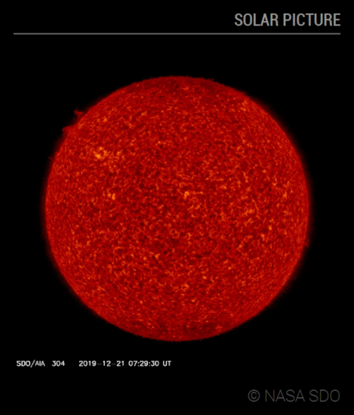
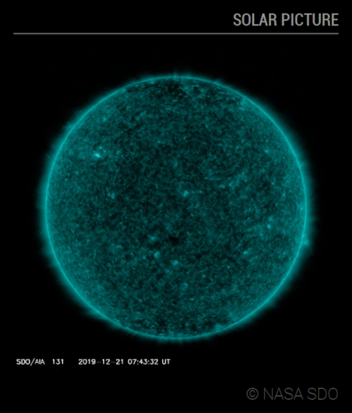
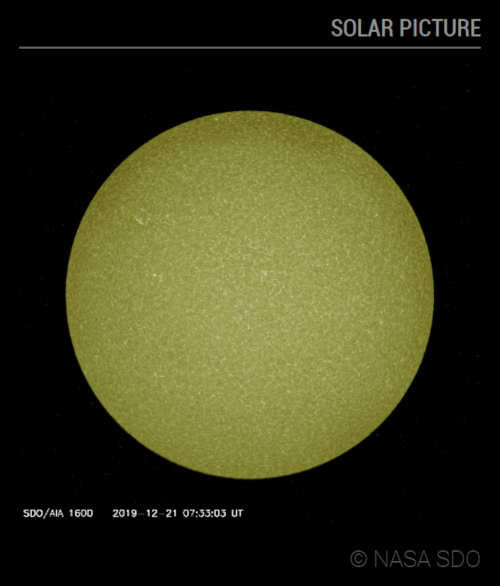

# Module: MMM-SolarPicture
This module displays the last Solar Dynamics Observatory (SDO) picture, including copyright.

The type of image displayed can be chosen or slideshow mode can be enabled. The max-height and max-width of the media can be fixed.

<p align="left">



</p>

[MagicMirror Project on Github](https://github.com/MichMich/MagicMirror) | [SDO on NASA](https://sdo.gsfc.nasa.gov)

## Installation:

In your terminal, go to your MagicMirror's Module folder:

```shell
cd ~/MagicMirror/modules
```
Clone this repository:
```shell
git clone https://github.com/grenagit/MMM-SolarPicture
```

Configure the module in your config.js file.

## Update:

In your terminal, go to your MMM-SolarPicture's Module folder:

```shell
cd ~/MagicMirror/modules/MMM-SolarPicture
```
Incorporate changes from this repository:
```shell
git pull
```

## Configuration:

### Basic configuration

To use this module, add it to the modules array in the `config/config.js` file:
```javascript
modules: [
	{
		module: "MMM-SolarPicture",
		position: "top_left",
		config: {
		}
	}
]
```

### Options

The following properties can be configured:


| Option                       | Description
| ---------------------------- | -----------
| `imageType`                  | Type of image captured by [Solar Dynamics Observatory](https://sdo.gsfc.nasa.gov/data/) present in `imageTable`. You can choose the wavelength used. <br><br> **Possible values:** view table below. <br> **Default value:** `'AIA 304'`
| `updateInterval`             | How often does the content needs to be fetched? (Milliseconds) <br><br> **Possible values:** `1000` - `86400000` <br> **Default value:** `1 * 60 * 60 * 1000` (1 hour)
| `transitionInterval`         | Display time of one image before moving to the next. If set to 0, the slideshow is disabled. (Milliseconds) <br><br> **Possible values:** `0` - `3600000` <br> **Default value:** `0` (slideshow disabled)
| `animationSpeed`             | Speed of the update animation. (Milliseconds) <br><br> **Possible values:**`0` - `5000` <br> **Default value:** `1000` (1 second)
| `maxMediaWidth`              | Maximum width for media display. If set to 0, the media's actual width is used. (Pixels) <br><br> **Possible values:**`0` - `5000` <br> **Default value:** `0` (media's width)
| `maxMediaHeight`             | Maximum height for media display. If set to 0, the media's actual height is used. (Pixels) <br><br> **Possible values:**`0` - `5000` <br> **Default value:** `0` (media's height)
| `initialLoadDelay`           | The initial delay before loading. (Milliseconds) <br><br> **Possible values:** `1000` - `5000` <br> **Default value:**  `0`
| `imageTable`                 | The image table to convert type of image to url. <br><br> **Default value:** view table below. |

### Default Image Table

```js
imageTable: {
	"AIA 193": "https://sdo.gsfc.nasa.gov/assets/img/latest/latest_1024_0193.jpg",
	"AIA 304": "https://sdo.gsfc.nasa.gov/assets/img/latest/latest_1024_0304.jpg",
	"AIA 171": "https://sdo.gsfc.nasa.gov/assets/img/latest/latest_1024_0171.jpg",
	"AIA 211": "https://sdo.gsfc.nasa.gov/assets/img/latest/latest_1024_0211.jpg",
	"AIA 131": "https://sdo.gsfc.nasa.gov/assets/img/latest/latest_1024_0131.jpg",
	"AIA 335": "https://sdo.gsfc.nasa.gov/assets/img/latest/latest_1024_0335.jpg",
	"AIA 094": "https://sdo.gsfc.nasa.gov/assets/img/latest/latest_1024_0094.jpg",
	"AIA 1600": "https://sdo.gsfc.nasa.gov/assets/img/latest/latest_1024_1600.jpg",
	"AIA 1700": "https://sdo.gsfc.nasa.gov/assets/img/latest/latest_1024_1700.jpg"
}
```

## Todo

- [x] Add slideshow with all SDO images
- [x] Add image preload
- [ ] Hide timestamp on the picture

## License

This module is licensed under the MIT License
